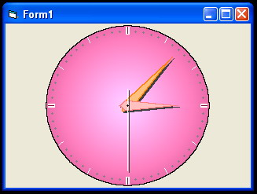



## Analog Clock OCX

### Description

Windows clock style with gradient effect.
 
### More Info
 
Obvious

             |
---                |---
**Submitted On**   |2004-10-16 14:54:22
**By**             |[Batavian](https://github.com/Planet-Source-Code/PSCIndex/blob/master/ByAuthor/batavian.md)
**Level**          |Beginner
**User Rating**    |5.0 (20 globes from 4 users)
**Compatibility**  |VB 6\.0
**Category**       |[OLE/ COM/ DCOM/ Active\-X](https://github.com/Planet-Source-Code/PSCIndex/blob/master/ByCategory/ole-com-dcom-active-x__1-29.md)
**World**          |[Visual Basic](https://github.com/Planet-Source-Code/PSCIndex/blob/master/ByWorld/visual-basic.md)
**Archive File**   |[Analog\_Clo18084410212004\.zip](https://github.com/Planet-Source-Code/batavian-analog-clock-ocx__1-56849/archive/master.zip)

